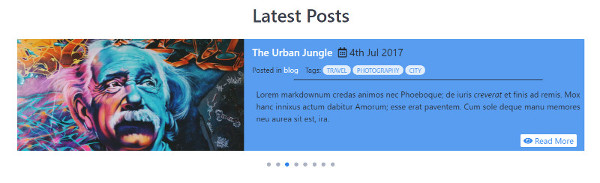
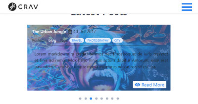

# Grav Xtra Features Plugin

**Xtra Features** is a plugin that adds some features to [Grav](http://github.com/getgrav/grav).

#### Available Features:
* Add a categories list on sidebar.
  * Show categories elsewhere.
* Add a list of latest post on sidebar.
  * Show a slider of latest post on page.
* Show a float "Go to Top" link.
* Enable Font Awesome 5 through CDN.


# Manual installation

Download the latest [release](https://github.com/StellarisStudio/grav-plugin-xtrafeatures/releases)  of this repository, unzip to `/your-grav/user/plugins` and rename the folder to `xtrafeatures`.

#### Dependency

* [Taxonomy List plugin](https://github.com/getgrav/grav-plugin-taxonomylist)

# Usage

#### Sidebar Categories

To add the categories list to the sidebar, past these lines of code into the `sidebar.html.twig` file of your theme:
```twig
{# Categories #}

  

```

#### Categories Elsewhere

If you want the Post Card to display the categories of each post, you can past these lines of code into the `blog-list-item.html.twig` file of your theme:
```twig

  

```

#### Sidebar Latest Post

To add the latest post list to the sidebar, past these lines of code into the `sidebar.html.twig` file of your theme:
```twig
{# Latest Posts #}

  

```

#### Latest Post Slider

The Slider works using the [lightslider](http://sachinchoolur.github.io/lightslider/) jQuery by Sachin N!

To add the latest post slider to a page, past these lines of code into the `*.md` file of the page:
```twig
Enable twig in the frontmatter:
---
process:
    twig: true
---
Twig to use:

```



Come with a _**basic**_ Responsive Design!!<br>


#### Go Top Link

To add the go back to top link, past these lines of code at the bottom of the `base.html.twig` file of your theme: _(just before ``)_
```twig
{# Back to Top #}

  

```

>> NOTE: This link is a Font Awesome.. You need to use a theme which contains the Font Awesome _(5 or lesser)_ or enable it in this plugin!

# Configuration

Simply go to the plugin settings from the [Admin Panel](https://github.com/getgrav/grav-plugin-admin).. Or copy the `xtrafeatures.yaml` file into your `user/config/plugins` folder and make your modifications.

`enabled: true` which turns the plugin on/off.<br>
`built_in_css: true` which activate the default plugin CSS. _(default: true)_

`showon_sidebar:` Add a categories list on sidebar. _(default: true)_<br>
`showon_post:` Add categories on post. _(default: true)_<br>
`show_sideLatest:` Add a list of latest post on sidebar. _(default: true)_<br>
`num_posts:` Number of post to show on sidebar. _(default: 5)_

`show_slideLatest:` Add a slide of latest post on page. _(default: true)_<br>
`show_slideTitle:` Show a title for the slider. _(default: true)_<br>
`slider_title:` The slider title. _(default: 'Latest Posts')_<br>
`posts_slider:` Number of post to show on the slider. _(default: 8)_<br>
`show_slideCats:` Show the post categories on the slider card. _(default: true)_<br>
`show_slideTags:` Show the post tags on the slider card. _(default: true)_<br>
`show_readMore:` Show the "Read more" Button. _(default: true)_<br>
`item:` The number of slides to show at a time. _(default: 1)_<br>
`auto:` Sets whether or not automatic transitions is enabled. _(default: 'true')_<br>
`loop:` Sets whether or not to loop the slides or stop at the last slide. _(default: 'true')_<br>
`speed:` Sets the time (in milliseconds) of the transition between slides. _(default: 1000)_<br>
`pause:` Sets the time (in milliseconds) between automatic transitions. _(default: 3000)_<br>
`pauseOnHover:` Sets whether or not it should pause the transitions on hover. _(default: 'true')_<br>
`enableControls:` Enables prev/next buttons. _(default: 'false')_<br>
`enableTouch:` Enables touch support for touch-enabled devices. _(default: 'true')_<br>
`enableDrag:` Enables desktop mouse drag support. _(default: 'true')_

`scrolltop:` Enables a link to the page top._(default: true)_<br>
`top_start:` Sets the scroll distance needed before showing the link. _(default: 400)_<br>
`top_fadeIn:` Sets the duration of the fade In. _(default: 400)_<br>
`top_fadeOut:` Sets the duration of the fade Out. _(default: 400)_

`fontawesome:` Enable Font Awesome 5 through CDN. _(default: false)_

>> NOTE: The build in CSS is made for the default settings... If you want to show more than 1 item at a time on the slider, you will have to make your own CSS!!

>> NOTE: You can add others settings to your slider, for a full list see on the [website](http://sachinchoolur.github.io/lightslider/) of the author, Sachin N!!

# License

MIT license. See [LICENSE](LICENSE)
